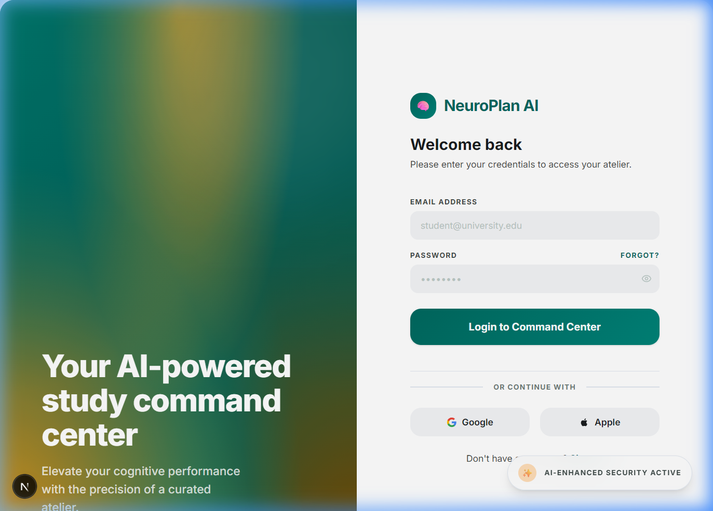
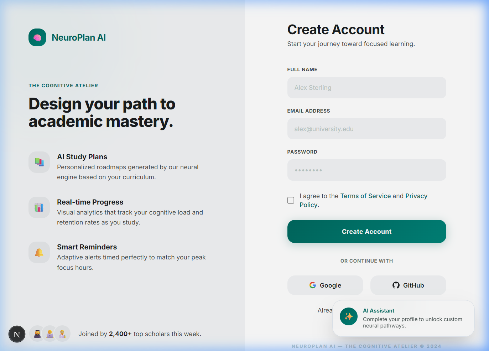
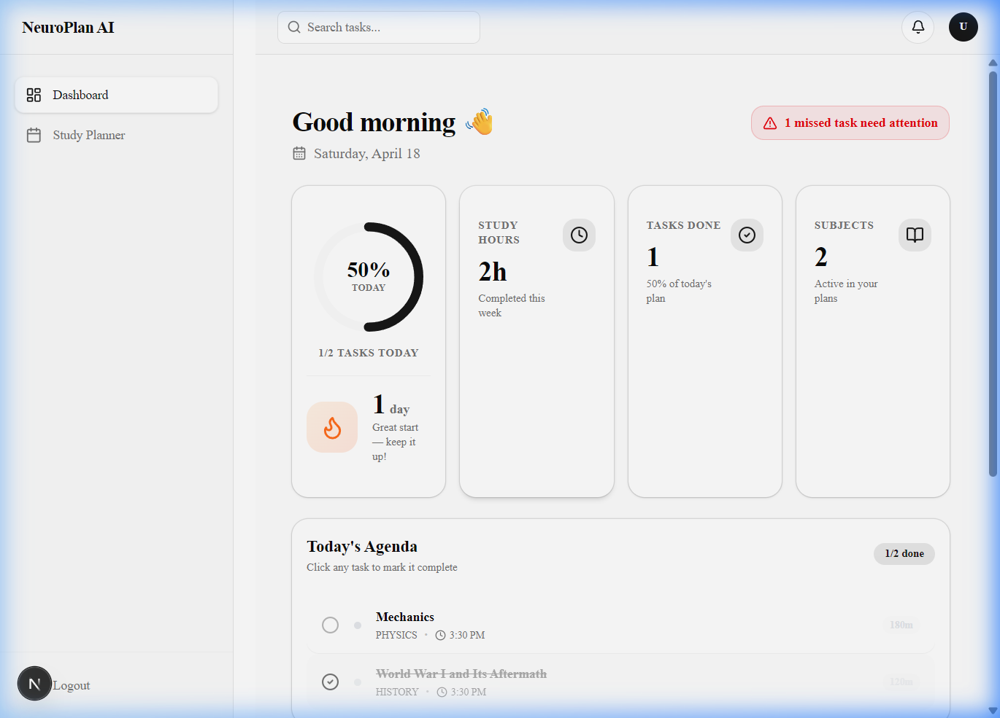
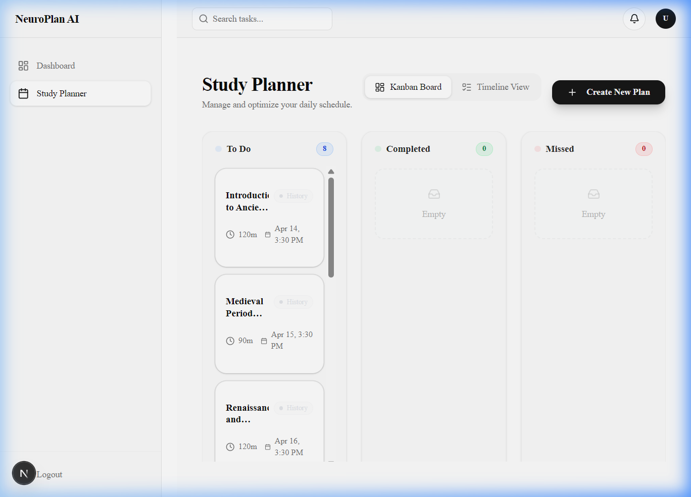
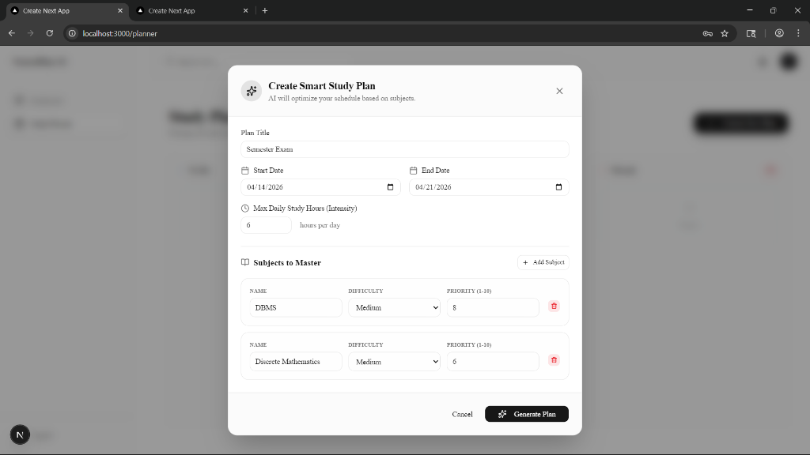

<div align="center">


<br /><br />

# 🧠 NeuroPlan AI

### AI-Powered Study Planner — Built for Students Who Mean Business

**NeuroPlan AI** is a production-grade, full-stack SaaS application that uses an LLM-powered scheduling engine to generate optimized, personalized study plans. It combines intelligent task distribution with a real-time dashboard, a Kanban-based planner, a data-driven calendar, and an automated notification system — all wrapped in a premium teal-and-amber "Cognitive Atelier" interface.

[Live Demo](#) · [Report Bug](#) · [Request Feature](#)

</div>

---

## 📸 Screenshots

### Login Page
> Two-panel layout with a mesh-gradient teal/amber hero on the left and a clean login form on the right. Supports email/password and OAuth (Google, Apple).

<p align="center">
  
</p>

### Signup Page
> Features marketing copy with key value props (AI Study Plans, Real-time Progress, Smart Reminders) alongside the registration form.

<p align="center">
  
</p>

### Dashboard
> Your real-time command center — circular progress ring, study streak counter, KPI cards (Study Hours, Tasks Done, Subjects), Today's Agenda with inline task completion, and missed task alerts.

<p align="center">
  
</p>

### Study Planner (Kanban Board)
> Three-column board (To Do → Completed → Missed) with drag-and-drop task reordering, subject pills, duration badges, and a "Create New Plan" CTA.

<p align="center">
  
</p>

### AI Plan Generation Modal
> Configure your study plan with title, date range, daily intensity slider, **study day selector** (pick exactly which days of the week to study), subjects with difficulty/priority settings, and one-click AI generation.

<p align="center">
  
</p>

---

## ✨ Features

### 🤖 AI-Powered Study Planning
- Generate complete, day-by-day study schedules using **LLaMA 3.3 70B** (via Groq API)
- AI respects daily intensity limits and applies **spaced repetition** principles
- **Study Day Selection** — pick specific weekdays (e.g., Mon/Wed/Fri) and tasks are only scheduled on those days
- Automatic fallback to a **deterministic mathematical scheduler** if AI times out or fails
- Supports multiple subjects with configurable difficulty (`easy`, `medium`, `hard`) and priority (1–10)

### 📊 Actionable Command-Center Dashboard
- **Time-aware greeting** and today's date
- **Circular progress ring** — today's task completion at a glance
- **Study streak counter** 🔥 — tracks consecutive active study days
- **Today's Agenda** — click any task to mark it complete inline, without leaving the dashboard
- **Last 7 Days activity chart** — planned vs. completed minutes side-by-side
- **Subject progress breakdown** — horizontal bars sorted weakest → strongest, with exact task counts
- **Missed task alert** banner — surfaces overdue work automatically

### 📋 Study Planner (Kanban Board)
- Three-column board: **To Do → Completed → Missed**
- Drag-and-drop task reordering powered by **@dnd-kit**
- Timeline & calendar views for upcoming sessions
- Reschedule tasks directly from the board

### 📅 Data-Driven Calendar
- **Real-time task visualization** — tasks appear as colored pills on their due dates
- **Subject color coding** — each task pill uses the subject's assigned color
- **Month navigation** — prev/next/today buttons
- **Stats bar** — total, completed, pending, and missed task counts for the visible month
- **Today highlight** — current date marked with a teal indicator

### 🔔 Notification & Reminder System
- In-app notification bell with real-time updates via **Supabase Realtime**
- **Upcoming task reminders** — cron job runs every hour, notifies for sessions within 2–3 hours
- **Missed task detector** — daily cron job identifies and flags overdue tasks
- Mark individual or all notifications as read

### 🔐 Authentication & Security
- Full **email/password authentication** via Supabase Auth
- OAuth support (**Google**, **Apple**)
- Session management with the Next.js 16 **Proxy** convention (`proxy.ts`)
- **Row Level Security (RLS)** enforced on all Supabase tables — users can only access their own data
- Protected routes with automatic redirects for unauthenticated users

---

## 🏗️ Architecture

```
neuroplan-ai/
├── src/
│   ├── app/
│   │   ├── (app)/                 # Protected routes (auth required)
│   │   │   ├── dashboard/         # Command-center dashboard
│   │   │   ├── planner/           # Kanban study planner
│   │   │   ├── calendar/          # Data-driven calendar view
│   │   │   └── analytics/         # Analytics page
│   │   ├── (auth)/                # Public routes
│   │   │   ├── login/
│   │   │   └── signup/
│   │   └── api/
│   │       └── cron/              # Vercel Cron job endpoints
│   │           ├── upcoming-reminders/
│   │           └── missed-tasks/
│   ├── actions/                   # Next.js Server Actions
│   │   ├── auth.ts
│   │   ├── notification.actions.ts
│   │   └── planner.actions.ts
│   ├── components/
│   │   ├── dashboard/             # Dashboard widgets
│   │   │   ├── ActivityGraph.tsx
│   │   │   ├── DailyAgendaCard.tsx
│   │   │   ├── StatsRing.tsx
│   │   │   ├── StudyStreakCard.tsx
│   │   │   └── SubjectBreakdownCard.tsx
│   │   ├── layout/                # App shell
│   │   │   ├── Sidebar.tsx
│   │   │   └── Header.tsx
│   │   ├── planner/               # Planner UI
│   │   │   ├── CreatePlanModal.tsx # AI plan generation with study day selector
│   │   │   ├── KanbanBoard.tsx
│   │   │   ├── SortableTask.tsx
│   │   │   └── TimelineView.tsx
│   │   └── ui/                    # shadcn/ui component library
│   ├── hooks/                     # React custom hooks
│   │   ├── useDashboardStats.ts
│   │   ├── useNotifications.ts
│   │   └── useTasks.ts
│   ├── services/                  # Business logic (server-side only)
│   │   ├── ai.service.ts          # Groq LLM integration
│   │   ├── planner.service.ts     # Schedule generation engine (study-day-aware)
│   │   ├── task.service.ts
│   │   ├── notification.service.ts
│   │   └── reminder.service.ts
│   ├── store/                     # Zustand global state
│   │   └── usePlannerStore.ts
│   ├── types/                     # TypeScript interfaces & DB types
│   ├── validators/                # Zod schemas (with study_days validation)
│   ├── lib/supabase/              # Supabase client helpers (server & browser)
│   └── proxy.ts                   # Next.js 16 Proxy (Middleware)
├── docs/screenshots/              # Application screenshots
├── vercel.json                    # Vercel Cron job configuration
├── supabase_schema.sql            # Complete database schema with RLS
└── package.json
```

### Layered Architecture

```
UI (React Components)
    ↓
Server Actions  (actions/)
    ↓
Services        (services/)
    ↓
Supabase DB     (PostgreSQL + RLS)
```

**AI Pipeline:**
```
User Input (subjects, dates, study_days, intensity)
    ↓
generateBaseSchedule()  →  Deterministic mathematical scheduler (fallback)
    ↓
generateAIStudyPlan()   →  Groq LLaMA 3.3 70B (primary, 15s timeout)
    ↓
Sanity Validation       →  Ensures daily hours not exceeded
    ↓
Bulk Insert             →  Tasks persisted to Supabase with due_date & subject_id
```

---

## 🛠️ Tech Stack

| Category | Technology |
|---|---|
| **Framework** | Next.js 16 (App Router, Turbopack) |
| **Language** | TypeScript 5 |
| **UI Library** | React 19 |
| **Styling** | Tailwind CSS 4 |
| **Component Library** | shadcn/ui |
| **Animations** | Framer Motion |
| **Database & Auth** | Supabase (PostgreSQL + Row Level Security) |
| **AI Engine** | Groq API — LLaMA 3.3 70B Versatile |
| **Forms** | React Hook Form + Zod |
| **State Management** | Zustand |
| **Drag & Drop** | @dnd-kit |
| **Charts** | Recharts |
| **Notifications (toast)** | Sonner |
| **Date Utilities** | date-fns |
| **Cron Jobs** | Vercel Cron |
| **Deployment** | Vercel |

---

## 🚀 Getting Started

### Prerequisites

- **Node.js** 18+
- A **Supabase** project ([create one free](https://supabase.com))
- A **Groq** API key ([get one free](https://console.groq.com))

### 1. Clone the Repository

```bash
git clone https://github.com/your-username/neuroplan-ai.git
cd neuroplan-ai
```

### 2. Install Dependencies

```bash
npm install
```

### 3. Configure Environment Variables

Create a `.env.local` file in the root of the project:

```env
# ── Supabase ─────────────────────────────────────────────────────────
NEXT_PUBLIC_SUPABASE_URL=https://your-project-ref.supabase.co
NEXT_PUBLIC_SUPABASE_ANON_KEY=your-supabase-anon-key

# ── AI Engine (Groq) ─────────────────────────────────────────────────
GROQ_API_KEY=gsk_your_groq_api_key

# ── Cron Security ────────────────────────────────────────────────────
# Generate with: openssl rand -base64 32
CRON_SECRET=your-generated-cron-secret
```

### 4. Set Up the Database

Run the `supabase_schema.sql` file in your **Supabase SQL Editor** (Dashboard → SQL Editor → New query → Paste & Run).

This creates all required tables (`subjects`, `study_plans`, `tasks`, `notifications`, `analytics`) with Row Level Security policies and performance indexes.

### 5. Run the Development Server

```bash
npm run dev
```

Open [http://localhost:3000](http://localhost:3000) in your browser.

### 6. Build for Production

```bash
npm run build
npm start
```

---

## ⚙️ Cron Jobs

Two automated background jobs run via **Vercel Cron**:

| Job | Endpoint | Schedule | Purpose |
|---|---|---|---|
| Upcoming Reminders | `/api/cron/upcoming-reminders` | Every hour (`0 * * * *`) | Finds tasks due in the next 2–3 hours and creates reminder notifications |
| Missed Task Detector | `/api/cron/missed-tasks` | Daily (`0 0 * * *`) | Marks past-due pending tasks as `missed` and creates alert notifications |

Each endpoint is secured with the `CRON_SECRET` environment variable — requests without a valid `Authorization: Bearer <secret>` header are rejected with `401`.

---

## 🚢 Deployment (Vercel)

This project is optimized for one-click deployment on Vercel.

1. **Push your repository** to GitHub / GitLab
2. **Import the project** in the [Vercel Dashboard](https://vercel.com/new)
3. **Set environment variables** (same as `.env.local` above) in the Vercel project settings
4. **Deploy** — Vercel automatically detects Next.js and handles everything

> **Note:** Cron Jobs defined in `vercel.json` are automatically registered when the project is deployed to Vercel. No additional setup needed.

---

## 📁 Key Environment Variables Reference

| Variable | Required | Description |
|---|---|---|
| `NEXT_PUBLIC_SUPABASE_URL` | ✅ | Your Supabase project URL |
| `NEXT_PUBLIC_SUPABASE_ANON_KEY` | ✅ | Your Supabase anonymous (public) key |
| `GROQ_API_KEY` | ✅ | Groq API key for LLaMA inference |
| `CRON_SECRET` | ✅ | Secret to authenticate cron job requests |

---

## 🤝 Contributing

Contributions, issues, and feature requests are welcome.

1. Fork the repository
2. Create your feature branch: `git checkout -b feature/amazing-feature`
3. Commit your changes: `git commit -m 'feat: add amazing feature'`
4. Push to the branch: `git push origin feature/amazing-feature`
5. Open a Pull Request

Please follow [Conventional Commits](https://www.conventionalcommits.org/) for commit messages.

---

## 📄 License

Distributed under the **MIT License**. See `LICENSE` for more information.

---

<div align="center">
  <p>Built by <strong>Faraaz</strong> with Next.js 16, Supabase, and Groq AI.</p>
</div>
 9